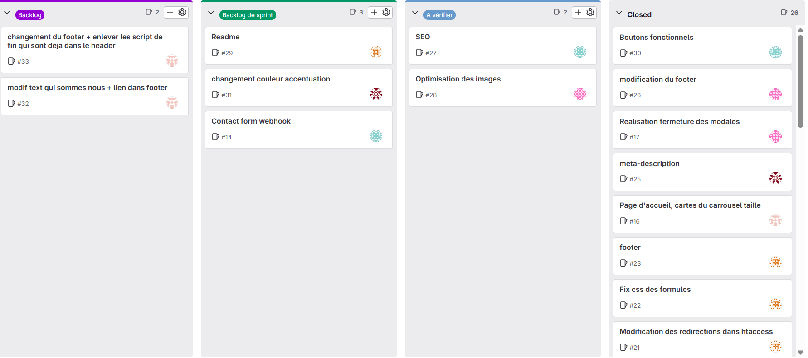

# Site Web Agence Ancreo


---

## 1. Présentation du projet

### Introduction
Ceci est le repository officiel du site web de l'agence Ancreo. <br>
Ancreo est une agence fictive créée dans le cadre des projets tutorés de la licence professionnelle MIAW (Métiers de l'Informatique et Applications Web).

### But de l'agence
**Ancreo** est une agence de **développement web** basée à La Rochelle.  
Nous proposons un accompagnement personnalisé et adapté pour les **entreprises, start-up, futurs entrepreneurs**.

### Membres du groupe
- [Labourdere Lea](https://github.com/lealabou) - Développeuse Full Stack
- [Curtil Maxime](https://github.com/akefis) - Développeur Full Stack
- [Hardel Sean](https://github.com/hardelSean) - Développeur Full Stack
- [Safsafi Yacine](https://github.com/Yacesf) - Développeur Full Stack
- [Bonhomme Elouan](https://github.com/BonhommeE) - Développeur Full Stack

[Accéder au site web.](https://agence-ancreo.lpmiaw.univ-lr.fr/)

[Accéder au figma du projet.](https://www.figma.com/design/0Jr37Ma4IllMO3V0Xw1HWD/Ancreo?node-id=0-1&t=gXzLrWPXjomH9BaT-1)

### Tech Stack
Voici la liste des technologies utilisées dans ce projet :

- Languages : PHP, HTML, CSS, JavaScript 
- Bibliothèques : Tailwind, GSAP, ThreeJS
- Collaboration : GitLab (workflow, collaboratif, gestions des issues)
- Design & maquettes : Figma
- Organisation : Discord, User Stories et suivi sur GitLab

### Méthode Agile
Le projet a été conduit selon une **démarche Agile** avec une organisation en **User Stories** et un suivi via un **tableau Kanban** (GitLab Issue Board).

#### Organisation Kanban
- **Open** : tâches initialisées, en attente de planification
- **Backlog** : ensemble des fonctionnalités à développer (vision long terme)
- **Backlog de sprint** : tâches priorisées et en cours de développement pendant le sprint
- **A vérifier** : tâches finies et en attente de test et vérification au sein de l'équipe
- **Closed** : tâches terminées et validées

#### Exemple de notre Kanban (GitLab)
Voici une capture d’écran du suivi du projet :



### User stories principales
- En tant que Pierre, je découvre l'agence suite à une **recherche** d'agence web à La Rochelle sur un moteur de recherche.
- En tant que Pierre, je veux pouvoir me **renseigner** sur l'agence Ancreo.
- En tant que Pierre, je veux pouvoir voir les différentes **formules d'accompagnement**.
- En tant que Pierre, je veux pouvoir cliquer sur une formule pour voir plus en **détail** ce qu’elle propose.
- En tant que Pierre, je veux pouvoir **naviguer** sur le site rapidement et de manière claire.
- En tant que Pierre, je veux pouvoir voir les différentes réalisations **réalisées** par l'équipe Ancreo..
- En tant que Pierre, je veux pouvoir cliquer sur une **réalisation** pour avoir plus de **détails** sur celle-ci.
- En tant que Pierre, je veux pouvoir **contacter** Ancreo grâce au formulaire afin d’obtenir un devis ou un premier échange.
- En tant que Pierre, je veux pouvoir retrouver les **informations** pour contacter ou me rendre à l'agence

---

#### Structure du projet

```
.
├── node_modules/          # Dépendances Node.js (non versionnées)
├── src/                   # Code source principal du site
│   ├── assets/            # Images des réalisations et médias
│   ├── components/        # Composants réutilisables (header, footer, nav)
│   ├── css/               # Feuilles de style CSS
│   ├── js/                # Scripts JavaScript
│   │   ├── anchor/        # Script lié à l'ancre
│   │   └── index/         # Script spécifique à la page d'accueil
│   └── *.php              # Pages PHP du site (accueil, réalisation, contact, etc.)
├── .gitignore             # Fichiers et dossiers ignorés par Git
├── .htaccess              # Configuration serveur et gestion des routes
├── demo.gif               # Démonstration animée de la page d'accueil Ancreo
├── IssueBoard.webp        # Capture de l'issue board du projet
├── LICENSE                # Licence MIT du projet
├── package.json           # Dépendances et scripts du projet
├── package-lock.json      # Verrouillage des versions des dépendances
└── README.md              # Documentation du projet
```

---

## 2. Installation

### Prérequis

- Serveur Apache
- PHP
- Node

### Étapes d’installation

Clonez le repo et installez les dépendances :
```bash
git clone git@gitlab.univ-lr.fr:lpmiaw-2025-2026/ancreo/agence.git
cd agence
npm install --production
```

Se placer à la racine et exécuter la commande pour compiler le CSS :
```bash
npm run build
```

## Licence
Ce projet est distribué sous licence MIT.